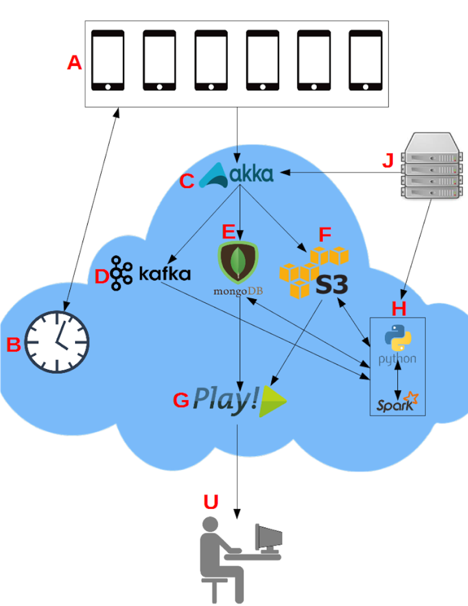
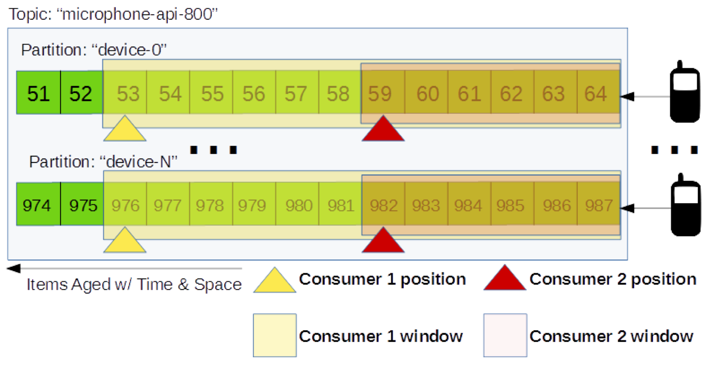
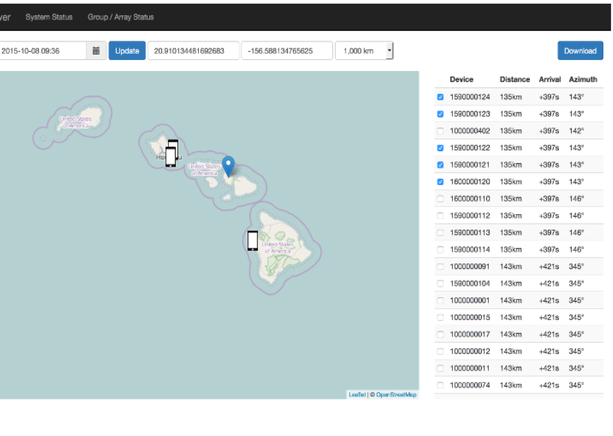
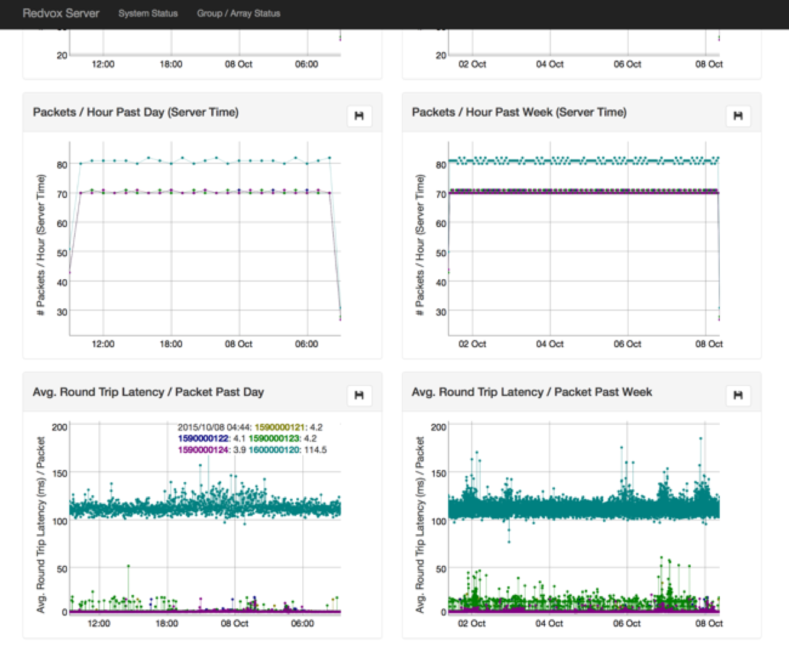
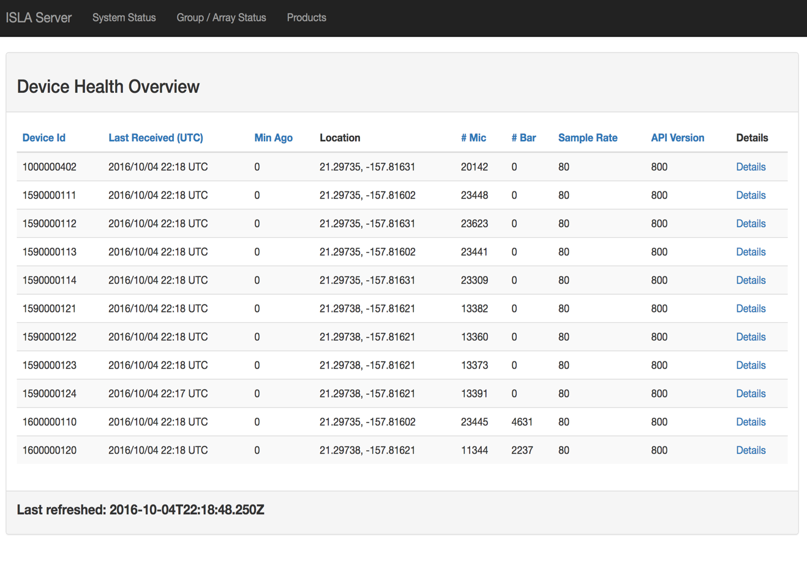

*Lokahi*, which means harmony in Hawaiian, is a set of software components that handle the acquisition, storage, 
analysis, and reporting of distributed sensor data. 

Increased velocity, volume, variety, and value of data has forced us to rethink the common server architecture and move 
towards a horizontally scalable cloud based computation model. Lokahi consists of the following layers.

### Distributed Acquisition
[Akka](http://akka.io/) actors are used to perform low level filtering and extraction of information at the server acquisition level. 
Actors are dynamically managed using an optimal actor pool resizing strategy. The types of actors used in our system are 
described below. 
 
##### Acquisition Actors
* Maintain persistent WebSocket connections with each distributed sensor
* Calculate and respond to sensors with checksums for each data packet
* Insert millisecond server side timestamp into data packet
* Extract from sensor packet: api version, sensor type
* Forward payload to correct decoding actor based on api and sensor type

##### Decoding Actors
* Deserialize meta-data based on API and sensor type
* Forward deserialized data to persistence layers

##### File System Actors
* Manage data payloads on a filesystem

##### AWS S3 Actors
* Manage data payloads in the cloud (Amazon Simple Storage Service)

##### MongoDB Actors
* Store deserialized meta-data to MongoDB

##### Kafka Actors
* Enqueue data payloads for real-time processing

### Distributed Real Time Queues

We utilize distributed [Kafka](http://kafka.apache.org/) queues to move data from acquisition to our analysis framework for real-time analysis of
our distributed sensors. 

Each sensor type receives its own Kafka topic. For example, when working with infrasound data
streams, we create topics both for microphone data and for barometer data. 

Topics are subdivided into partitions. Partitions are the unit of parallelism within Kafka and the default way of 
distributing data payloads over a cluster of computers. A consumer is created per topic. Each consumers job is to
maintain their offset into the topic. By maintaining its offset, the consumer can skip forward and backward through a 
partition. Utilizing this functionality allows consumers to consume variable window lengths of data depending on the
type of processing that is required.

### Distributed Persistence (Meta-Data)
Meta-data is persisted using a [MongoDB](https://www.mongodb.com/) cluster. The meta-data contains fields describing the actual waveform payload as
well as fields describing the state of the sensor at that time including but not limited to timestamps, timing 
information, sensor types, calibration constants, position, api version.. etc. Once this data is stored, it can be
queried for analysis and also queried to display system health and metrics.

### Distributed Persistence (Payload)
Data files are stored for historical analysis in Amazon's distributed 
[Simple Storage Service (S3)](https://aws.amazon.com/s3/). Keys to the files are stored and indexed in MongoDB. 
This makes it simple to query ranges of data filtered by device, location, sensor, or time, and then obtain direct links
to the data on S3 for batch download.

### Distributed Analysis
Real-time analysis is performed by retrieving data from a distributed kafka queues and distributing that data over a
cluster using [Apache Spark](http://spark.apache.org/) and [Spark Streaming](http://spark.apache.org/streaming/) 
to perform distributed analysis and plotting. Products can then be forwarded to other processes with a Kafka queue for 
further computation. Final products can then be stored in S3 and then indexed using MongoDB.

### Distributed Metrics / Data Access
The [Play Framework](https://www.playframework.com/) is used to serve dynamic web content to users. We display products 
of analysis, network health metrics, maps of sensors, and access to data. We also provide a data API. Queries for data 
are distributed using Akka actors.

## More Information

Coming soon...